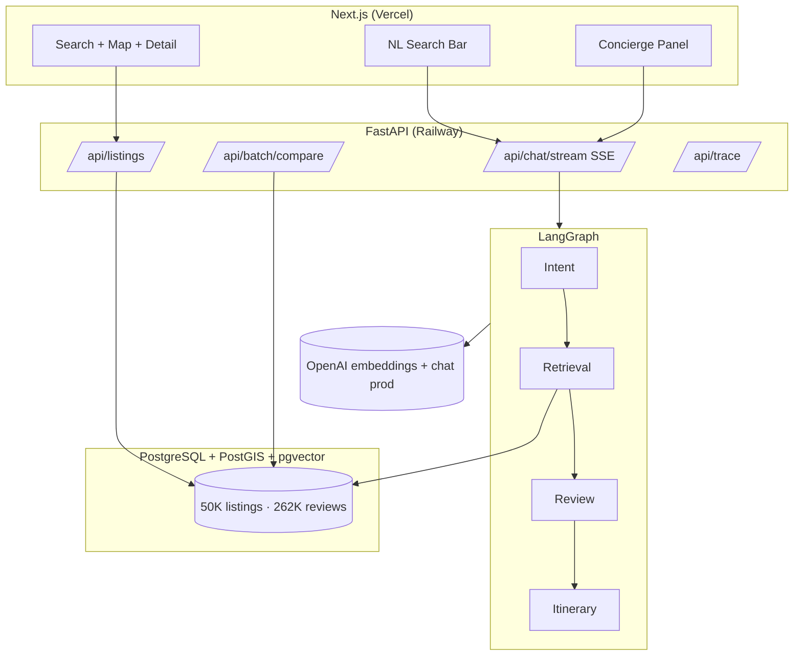

# Travel AI Platform

AI-native travel discovery and booking: search, map, property detail, wishlist, compare, and a LangGraph multi-agent concierge.

**Live demo:** https://travel-ai-app-five.vercel.app · **API:** https://travel-ai-app-production-bc05.up.railway.app

## One-command local start

```bash
chmod +x scripts/run-local.sh
./scripts/run-local.sh
```

Then in **two terminals**:

```bash
# Terminal 1 — API
cd backend && python3 -m venv .venv && source .venv/bin/activate
pip install -r requirements.txt
uvicorn app.main:app --reload --port 8000

# Terminal 2 — UI
cd frontend && npm install && cp .env.local.example .env.local
npm run dev
```

Open **http://localhost:3000**

**Prerequisites:** Docker Desktop, Node 18+, Python 3.11+, `OPENAI_API_KEY` in root `.env` (embeddings + optional OpenAI chat).

**Local chat (optional):** `ollama pull qwen2.5:3b && ollama pull llama3.1:8b` — see `.env.example`.

**First-time data:** ingest Inside Airbnb CSVs — see [Data](#data-choice) or `proj-docs/proj-progress.md`.

---

## Architecture



**Why LangGraph:** Intent-based routing, shared `GraphState`, and `astream_events` maps to hybrid SSE without custom orchestration.

---

## Features

| Area | What |
| :--- | :--- |
| **Search** | Filters, map bbox, calendar availability, sort, pagination |
| **NL search** | Parses query → filter chips → refreshes list (`mode=search`) |
| **Concierge** | Intent → Retrieval → Review → Itinerary (`mode=concierge`) |
| **Property detail** | Reviews, aspects, calendar, AI summary, mock Reserve |
| **Wishlist** | `localStorage` + `/wishlist` |
| **Compare** | 2–5 stays, matrix + `POST /api/batch/compare` AI verdict |
| **Trace** | `GET /api/trace/{request_id}` — steps, latency, tokens |
| **Cache** | Redis or in-memory — retrieval 5m, review/compare 1h, summaries 24h |
| **Batch** | `POST /api/batch/compare`, `POST /api/batch/summarize` (parallel) |

API docs: http://localhost:8000/docs

---

## Data choice

**Inside Airbnb** ([insideairbnb.com](https://insideairbnb.com/get-the-data/)) — 5 European cities: Lisbon, Amsterdam, Barcelona, Bergamo, Madrid.

| | Count |
| :--- | ---: |
| Listings ingested | 50,037 |
| Reviews ingested | 262,461 |
| Cities | 5 |

**Ingestion:** `ingestion/scripts/ingest.py` — 90-day calendar, amenity normalization, OpenAI embeddings @ 512-dim, capped reviews per listing.

---

## Key trade-offs

1. **Local full corpus / deploy DB slice** — free-tier limits; pipeline proven locally.
2. **Embeddings fixed to OpenAI 512-dim** — stable vector space across environments.
3. **Chat LLMs pluggable** — Ollama locally; any OpenAI-compatible API in prod (`LLM_BASE_URL` + `LLM_API_KEY`). Embeddings always OpenAI.
4. **Listing embeddings only** — review agent uses SQL, not full review vectors.
5. **90-day calendar** — keeps calendar table bounded.
6. **No auth** — wishlist in `localStorage`.
7. **EU cities only** — unsupported-city message for out-of-corpus queries.
8. **Citation fallback** — DB-backed links when LLM omits structured citations.

---

## Cost per query (production, OpenAI)

| Query type | Approx cost |
| :--- | ---: |
| NL search | ~$0.0002 |
| Search + review | ~$0.001 |
| Full itinerary | ~$0.03 |

~1,000 queries/day ≈ **$2–3/day**.

---

## Deploy

See **[DEPLOY.md](./DEPLOY.md)** — Railway (API) + Vercel (frontend) + Supabase (Postgres/pgvector).  
Deploy checklist and ingest logs: **[proj-docs/deploy-progress.md](./proj-docs/deploy-progress.md)**.

---

## Evaluation

See **[EVAL.md](./EVAL.md)** — golden queries and rubric.

---

## Repo layout

```
backend/          FastAPI + LangGraph agents
frontend/         Next.js 14 App Router
ingestion/        Inside Airbnb ingest pipeline
init-extensions.sql   PostGIS + pgvector schema
docker-compose.yml    Postgres + Redis (local)
proj-docs/        Architecture notes and progress log
```

---

## Local stack

| Service | URL |
| :--- | :--- |
| PostgreSQL | `localhost:5432` |
| FastAPI | http://localhost:8000 |
| Next.js | http://localhost:3000 |
| Redis | `localhost:6379` (optional cache) |
| Ollama | `localhost:11434` (local chat only) |
