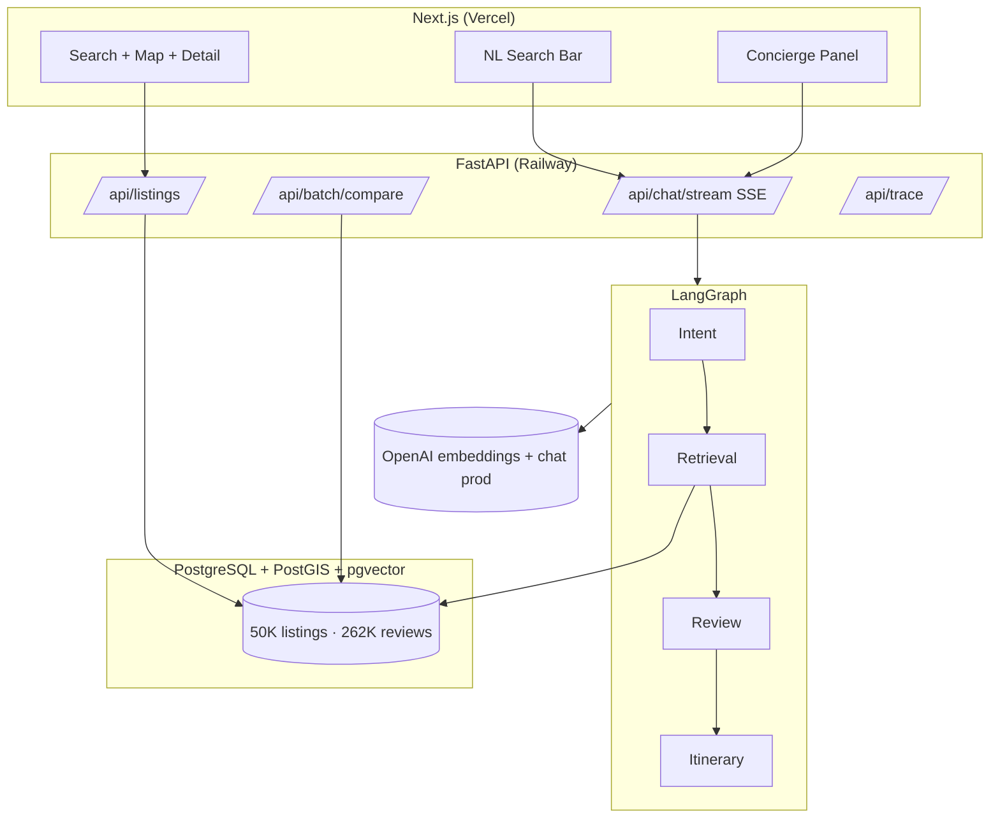

# Travel AI Platform

AI-native travel discovery and booking — Full Stack AI Developer assignment.  
Booking-style product (search, map, detail, wishlist, compare) with a **LangGraph multi-agent** concierge on top.

## One-command local start

```bash
chmod +x scripts/run-local.sh
./scripts/run-local.sh
```

Then in **two terminals**:

```bash
# Terminal 1 — API
cd backend && python3 -m venv .venv && source .venv/bin/activate
pip install -r requirements.txt
uvicorn app.main:app --reload --port 8000

# Terminal 2 — UI
cd frontend && npm install && cp .env.local.example .env.local
npm run dev
```

Open **http://localhost:3000**

**Prerequisites:** Docker (OrbStack/Docker Desktop), Node 18+, Python 3.11+, `OPENAI_API_KEY` in root `.env` (embeddings + optional OpenAI chat).

**Local chat (optional):** `ollama pull qwen2.5:3b && ollama pull llama3.1:8b` — see `.env.example` Option A.

**First-time data:** ingest Inside Airbnb CSVs — see [Data](#data-choice) below or `proj-docs/proj-progress.md`.

---

## Architecture



**Why LangGraph:** Intent-based routing (search vs review vs itinerary), shared `GraphState` between agents, and `astream_events` maps cleanly to hybrid SSE (`node_start`, `filters_parsed`, `citations_loaded`, `complete`) without custom orchestration code.

---

## Features

| Area | What |
| :--- | :--- |
| **Search** | Filters, map bbox, calendar availability, sort, pagination |
| **NL search** | Parses query → filter chips → refreshes list (`mode=search`) |
| **Concierge** | Intent → Retrieval → Review → Itinerary (`mode=concierge`) |
| **Property detail** | Reviews, aspects, calendar, AI summary, mock Reserve |
| **Wishlist** | `localStorage` + `/wishlist` |
| **Compare** | 2–4 stays, matrix + `POST /api/batch/compare` AI verdict |
| **Trace** | `GET /api/trace/{request_id}` — chat + batch routes (steps, latency, tokens) |
| **Cache** | Redis (or in-memory fallback) — retrieval 5m, review/compare 1h, summaries 24h |
| **Batch** | `POST /api/batch/compare` (2–5 stays), `POST /api/batch/summarize` (up to 20, parallel) |

Full API docs: run backend → http://localhost:8000/docs

---

## Data choice

**Inside Airbnb** open data ([insideairbnb.com](https://insideairbnb.com/get-the-data/)) for **5 European cities**: Lisbon, Amsterdam, Barcelona, Bergamo, Madrid.

| | Count |
| :--- | ---: |
| Listings ingested | 50,037 |
| Reviews ingested | 262,461 |
| Cities | 5 |

**Why real data:** authentic prices, geo, reviews, and calendar for map + availability filters. Synthetic data would not exercise pgvector semantic search or review synthesis credibly.

**Ingestion:** `ingestion/scripts/ingest.py` — 90-day calendar window, amenity normalization, OpenAI embeddings @ 512-dim (`halfvec`), capped reviews per listing. See `proj-docs/proj-progress.md` for logs.

---

## Key trade-offs

1. **Local 50K+ / deploy ~10–15K slice** — free-tier DB limits; full pipeline proven locally.
2. **Embeddings fixed to OpenAI 512-dim** — prevents vector space mismatch if chat LLM changes.
3. **Chat LLMs pluggable** — Ollama locally, OpenAI in production (`EVAL.md` uses prod config).
4. **Listing embeddings only** — review agent uses relational SQL, not 200K review vectors.
5. **90-day calendar** — avoids multi-million calendar rows.
6. **No auth** — wishlist in `localStorage` per brief.
7. **No Dubai** — dataset is EU cities; unsupported-city message for out-of-scope queries.
8. **Citation fallback** — when Ollama skips structured citations, links built from DB reviews.
9. **Cache** — Redis when `REDIS_URL` set, else in-memory; retrieval/review/compare/summary TTLs documented in `app/cache.py`.

---

## Cost per query (production, OpenAI)

| Query type | Approx tokens | Cost |
| :--- | :--- | ---: |
| NL search (intent + retrieval) | 800 in + 200 out | ~$0.0002 |
| Search + review compare | 3K in + 800 out | ~$0.001 |
| Full itinerary | 5K in + 2K out | ~$0.03 |
| Embedding per semantic query | ~100 tokens | ~$0.000002 |

**~1,000 queries/day** (80% search, 15% review, 5% itinerary) ≈ **$2–3/day**.

One-time ingest embeddings ≈ **$0.10** for 50K listings.

---

## With another week

- Automated golden-query eval CI (`EVAL.md` → pytest)
- Precomputed review summaries for all deploy listings
- Redis cache for search/compare
- Guest selector + property type filters in UI
- Concierge itinerary → editable day cards with swap-out

---

## Deploy

See **[DEPLOY.md](./DEPLOY.md)** — Railway (API) + Vercel (frontend) + Supabase (Postgres/pgvector).

---

## Evaluation

See **[EVAL.md](./EVAL.md)** — golden queries, rubric, manual scores.

---

## Loom script (~5 min)

1. **Filter search** (30s) — Lisbon, price, dates → list + map sync.
2. **NL search** (45s) — type golden query fragment → chips update → results refresh.
3. **Complex concierge** (90s) — full Lisbon review query → pipeline steps → listings on map → citations → compare link.
4. **Failure case** (45s) — "Dubai trip" → unsupported city message (or disconnect Ollama → graceful error).

---

## Repo layout

```
backend/          FastAPI + LangGraph agents
frontend/         Next.js 14 App Router
ingestion/        Inside Airbnb ingest pipeline
init-extensions.sql   PostGIS + pgvector schema
docker-compose.yml    Postgres + Redis (local)
proj-docs/        Plan, progress, assignment brief
```

---

## Local stack

| Service | URL |
| :--- | :--- |
| PostgreSQL | `localhost:5432` |
| FastAPI | http://localhost:8000 |
| Next.js | http://localhost:3000 |
| Redis | `localhost:6379` (optional cache — not wired yet) |
| Ollama | `localhost:11434` (local chat only) |

---

## License

Assignment submission — see repository owner for terms.
