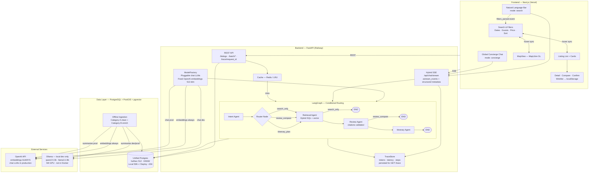
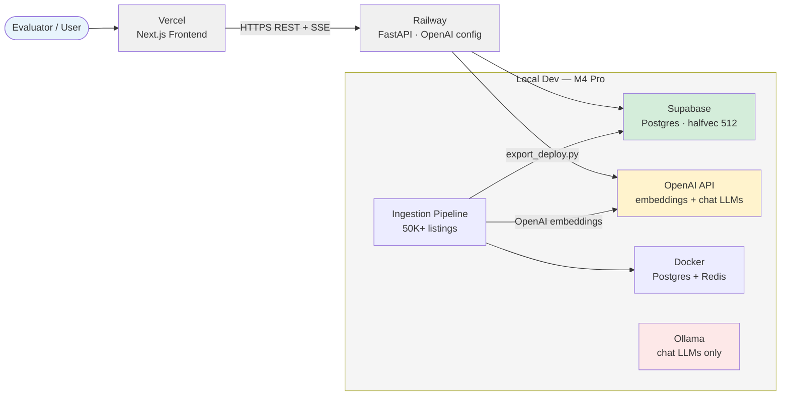
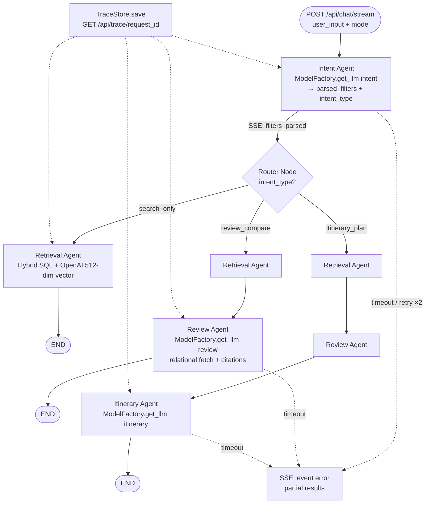
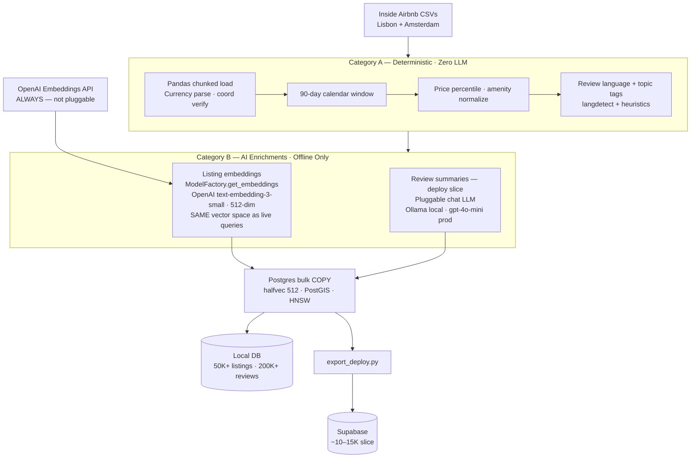
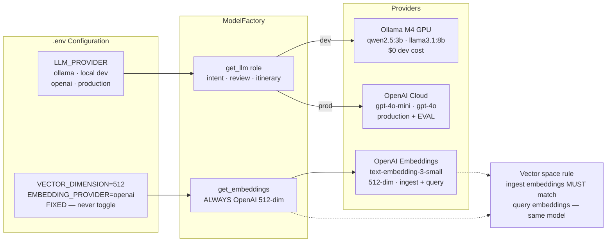
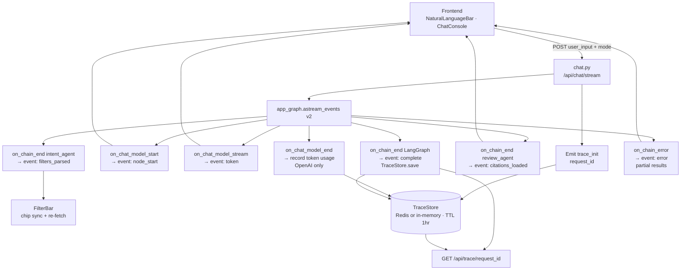
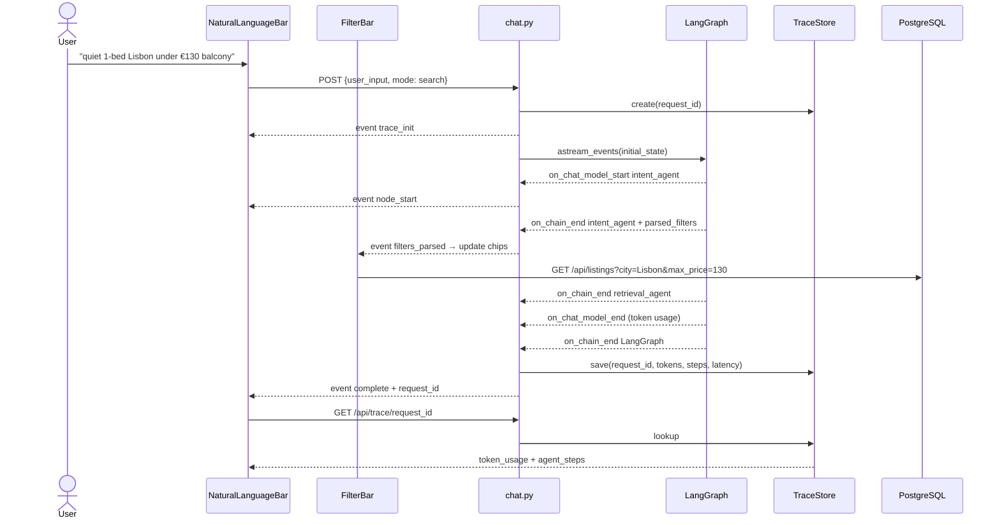

# High-Level Component Diagram

Architecture reference aligned with `PROJECT_PLAN.md`. All diagrams use
**Mermaid** for visual rendering in Cursor, GitHub, and Markdown previews.

**Core diagrams:** §1 Overview · §2 Deployment · §4 Ingestion · §6 Hybrid SSE
**Detail diagrams:** §3 Agent Routing · §5 Model Factory · §7 Request Flow

---

## 1. System Overview



---

## 2. Deployment Topology



---

## 3. LangGraph Agent Routing (Detail)



---

## 4. Ingestion Pipeline (Category A + B)



---

## 5. Pluggable Model Factory



---

## 6. Hybrid SSE Streaming Architecture



---

## 7. Request Flow — NL Search with Filter Sync



---

## Key Interactions

### Hybrid SSE events (not raw tokens alone)

| Event | Payload | Frontend action |
| :--- | :--- | :--- |
| `trace_init` | `request_id` | Store for trace lookup |
| `node_start` | `node` name | Show agent progress in ChatConsole |
| `token` | streaming text | Append to chat bubble |
| `filters_parsed` | structured `filters` | FilterBar chip sync + re-fetch listings |
| `citations_loaded` | `citations[]` | Render clickable review links |
| `complete` | `request_id`, `latency_ms` | Close stream |
| `error` | `node`, `recoverable` | Show partial results + fallback message |

### Embeddings vs chat LLMs — pluggability rules

| Component | Pluggable? | Local | Production |
| :--- | :--- | :--- | :--- |
| Embeddings | **No — fixed** | OpenAI 512-dim | OpenAI 512-dim |
| Intent / Review LLM | **Yes** | Ollama qwen2.5:3b | gpt-4o-mini |
| Itinerary LLM | **Yes** | Ollama llama3.1:8b | gpt-4o |
| EVAL scoring | — | — | **OpenAI only** |
| Token telemetry | — | Unreliable (Ollama) | Authoritative (OpenAI) |

### Two AI entry points

| Entry | Component | Mode | Typical path |
| :--- | :--- | :--- | :--- |
| Results page | `NaturalLanguageBar.tsx` | `search` | Intent → Retrieval → END |
| Anywhere | `ChatConsole.tsx` | `concierge` | Intent → Router → full path |

### Conditional routing

- **`search_only`** → Retrieval → END (Itinerary never invoked)
- **`review_compare`** → Retrieval → Review → END
- **`itinerary_plan`** → Retrieval → Review → Itinerary → END

### Review agent — relational, not vector

Fetches reviews by `listing_id` (SQL). No review embeddings in corpus.
Citations validated against fetched `review_id`s before SSE emit.

### Caching layers

| Layer | Key | TTL |
| :--- | :--- | :--- |
| Redis / LRU | `search:{hash}` | 5 min |
| Redis / LRU | `summary:{listing_id}` | 24 hr |
| Redis / LRU | `compare:{ids}` | 1 hr |
| Postgres | `listing_review_summaries` | permanent |

---

## Data Flow — Example Queries

### Query A: NL search

```
User: "quiet 1-bedroom in Lisbon under €130 with balcony for late June"
  → Intent → filters_parsed SSE → FilterBar chips update
  → Retrieval (hybrid SQL + OpenAI 512-dim vector)
  → complete event + request_id
```

### Query B: Review comparison

```
User: "...which has the most consistent reviews?"
  → intent_type: review_compare
  → Retrieval → Review → citations_loaded SSE event
  → complete
```

### Query C: Itinerary (Lisbon/Amsterdam — not Dubai)

```
User: "Plan 4 nights in Lisbon, mid-range near metro + splurge night with view"
  → intent_type: itinerary_plan
  → Retrieval → Review → Itinerary → complete
```

### Query D: Failure case (Loom demo)

```
Review node timeout after retry ×2
  → SSE: {event: error, node: review_agent, recoverable: true}
  → Partial: retrieval results still visible
  → GET /api/trace/request_id shows failed step + latency
```

---

## Component ↔ File Mapping

| Diagram block | Code location |
| :--- | :--- |
| ModelFactory | `backend/app/agents/factory.py` |
| Hybrid SSE router | `backend/app/routers/chat.py` |
| TraceStore | `backend/app/agents/telemetry.py` |
| Trace GET endpoint | `backend/app/routers/trace.py` |
| LangGraph graph | `backend/app/agents/graph.py` |
| Router node | `backend/app/agents/nodes/router.py` |
| Env template | `.env.example` |
| SSE client parser | `frontend/src/lib/sse.ts` |
| Natural Language Bar | `frontend/src/components/NaturalLanguageBar.tsx` |
| Global Concierge | `frontend/src/components/ChatConsole.tsx` |
| FilterBar (chip sync) | `frontend/src/components/FilterBar.tsx` |
| Ingestion Category A+B | `ingestion/scripts/ingest.py` |
| Deploy export | `ingestion/scripts/export_deploy.py` |
